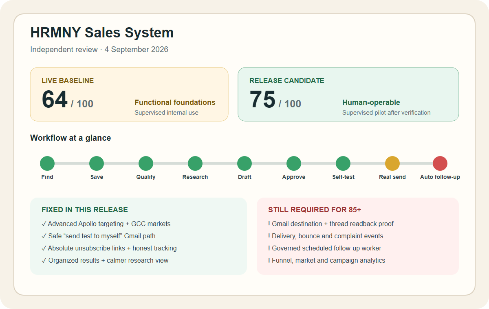

# HRMNY Sales System — independent review

**Review date:** 4 September 2026

**Scope:** lead generation, enrichment, research, qualification, outreach, tracking, monitoring, follow-up, dashboard, and human usability

**Method:** authenticated production walkthrough + repository flow trace + contract/test review

**Safety:** no Apollo search/enrichment credit and no email were consumed during this audit

## 60-second verdict

> **The core is real, but the live system is not yet a complete autonomous sales engine.** It stores CRM records, persists sourced research briefs, drafts approval-gated outreach, identifies the connected Gmail sender, and calculates a reply-aware follow-up queue. The weak points are provider delivery evidence, bounce/complaint monitoring, automatic follow-up execution, and decision-grade funnel analytics.

- **Live baseline: 64/100** — functional but confusing in key places; supervised internal use only.
- **This release candidate: 75/100** — suitable for a supervised client pilot after migration, deployment, and live UI verification.
- **Not claimed:** autonomous outbound, verified Gmail destination delivery, bounce handling, or client UAT.

## Mile 2 closeout delta

The stakeholder mockups were treated as workflow evidence, not a replacement UI. The release candidate now merges their useful operating patterns into the existing CRM:

- Sales opens on actionable **Waiting on me**, **Stalled**, **Moving this week**, and **Closing** queues backed by live CRM records.
- Pipeline cards show owner, age, next action, due date, and the exact missing gate; movement remains one governed step at a time.
- Deal pages have the eight-stage strip, structured client needs, a dated/owned next action, advisory AI, and a visible handover path.
- Outreach is one oldest-first approval queue; replies use the same stage gates and cannot create half-promoted deal state.
- Scope and pricing use the HRMNY rate card, expose cost/margin only to authorized roles, and fail closed on unconfigured rates or margin/discount violations.
- Handover requires six server-verified facts before creating Delivery records; the accepted quote is authoritative for the contract and proposed invoice.

Still outside Mile 2 code closeout: a searchable archive/90-day retention state, a client-facing proposal artifact/send flow, provider delivery/bounce receipts, the governed follow-up worker, production deployment proof, and Ayham/Maolham UAT.

## Scorecard

| Area                       |  Weight |   Live | Release candidate | What the evidence says                                                                                                                 |
| -------------------------- | ------: | -----: | ----------------: | -------------------------------------------------------------------------------------------------------------------------------------- |
| Targeting and discovery    |      15 |      6 |                12 | Live only exposed title + keyword + fixed UAE. The release adds documented Apollo filters and GCC markets.                             |
| CRM persistence and dedupe |      10 |      9 |                 9 | Saved candidates become canonical company/contact/deal records and are reused instead of piled up.                                     |
| Qualification and research |      15 |     12 |                12 | BUAF saves; cited company briefs persist. The full brief was visually overwhelming and is collapsed in the release.                    |
| Outreach and sender safety |      15 |      9 |                12 | Draft/approve/send gates exist. The release adds server-enforced self-test sending and absolute unsubscribe links.                     |
| Tracking and follow-up     |      15 |      6 |                 6 | Replies can be ingested and due dates are calculated, but delivery/bounce hooks and automatic cadence execution are incomplete.        |
| Dashboard and analytics    |      10 |      7 |                 7 | Real queue, pipeline, value, and outreach totals are visible; conversion, channel, market, campaign, and owner views are absent.       |
| Human UX                   |      10 |      6 |                 8 | The operating path is visible. The release reduces result piles, page overflow, and brief overload, and makes test sending explicit.   |
| Governance and reliability |      10 |      9 |                 9 | Paid enrichment and real sends fail closed behind explicit approval and durable receipts. External destination proof remains separate. |
| **Total**                  | **100** | **64** |            **75** | **Supervised pilot after release verification; not yet hands-off outbound.**                                                           |

## End-to-end workflow status

`Find clients 🟢 → Save lead 🟢 → Qualify 🟢 → Research 🟢 → Draft 🟢 → Approve 🟢 → Test myself 🟢 → Send prospect 🟡 → Detect reply 🟡 → Re-send automatically 🔴 → Learn from funnel 🟡`

- 🟢 **Working/implemented:** canonical storage, dedupe, BUAF, cited brief, draft, approval, internal-only test path.
- 🟡 **Partially proven:** real Gmail sending, reply ingestion, and dashboard learning exist in code but lack a full destination acceptance receipt in this review.
- 🔴 **Missing:** a governed worker that creates/schedules the next approved follow-up and a provider-backed delivery/bounce/complaint loop.

## Fixed in this release

1. **Apollo search is no longer a toy form.** Operators can use multiple job titles, similar titles, seniority, personal location, company-HQ location, company size, email availability, and technology IDs. Market presets cover UAE, KSA, Oman, Qatar, Kuwait, Bahrain, and GCC. These map only to fields in Apollo's official [People API Search](https://docs.apollo.io/reference/people-api-search).
2. **Market intent survives save.** The normalized search criteria is stored with the provider receipt and reused when the person becomes a CRM record. A lead found in Oman is not stamped UAE.
3. **Searches no longer form one endless list.** New results, saved results, and all results have separate views; duplicate CRM candidates reuse existing records.
4. **Gmail has a harmless test path.** “Send test to myself” resolves the current operator's connected `@hrmny.co` Gmail profile on the server. It cannot target the prospect, cannot accept a browser-supplied recipient, and does not change the outreach status or follow-up cadence. Gmail's official send/profile contracts are [messages.send](https://developers.google.com/workspace/gmail/api/reference/rest/v1/users.messages/send) and [users.getProfile](https://developers.google.com/workspace/gmail/api/reference/rest/v1/users/getProfile).
5. **Tracking no longer invents delivery.** Seven days without a reply records `no_response`; it does not manufacture a `delivered` event.
6. **Unsubscribe links are usable from an inbox.** The shared message builder emits an absolute HTTPS URL, not the relative path found in the live draft.
7. **The lead page is calmer.** Long briefs start collapsed, action steps remain visible, and unbroken tokens no longer widen the outreach page.

## Faults still present

| Priority | Fault                                                                     | Human impact                                                                                             | Required proof/fix                                                                                                            |
| -------- | ------------------------------------------------------------------------- | -------------------------------------------------------------------------------------------------------- | ----------------------------------------------------------------------------------------------------------------------------- |
| P0       | No completed destination acceptance for a Gmail test in this review       | A green UI cannot prove the message arrived                                                              | Operator clicks the internal-only test; read back Gmail message/thread ID and confirm receipt in the same mailbox.            |
| P0       | No provider delivery/bounce/complaint ingestion                           | “Sent” can be confused with “delivered” and bad addresses are not automatically suppressed               | Ingest provider events, bind them to message/thread IDs, suppress bounce/complaint recipients, and show evidence on the lead. |
| P0       | Follow-up queue calculates dates but does not execute a governed schedule | Salespeople can miss touch 2/3 unless they manually revisit Outreach                                     | Scheduled job creates the next draft; human approval remains mandatory before each send.                                      |
| P1       | Dashboard lacks search→save→research→draft→send→reply conversion          | Management cannot see where leads are leaking                                                            | Add a funnel segmented by market, owner, channel, campaign, and date; use canonical events only.                              |
| P1       | Real sender cannot be selected per campaign                               | Teams with several approved mailboxes cannot control identity clearly                                    | Add a connected-mailbox selector and per-sender daily cap; show the sender in preview and receipt.                            |
| P1       | Approval and final send checks occur at different moments                 | A human can approve copy that a later truthfulness guard blocks                                          | Run the same send-time checks before approval and show exact corrective copy.                                                 |
| P1       | Research→People Search does not prefill the known company and market      | Operators repeat data and can search the wrong geography                                                 | Carry company, domain, and market into Find Clients as visible editable defaults.                                             |
| P2       | Apollo coverage is still bounded                                          | Revenue, hiring signals, domain include/exclude, person name, exclusions, and pagination are not exposed | Add only when a real prospecting play requires them; the backend contract already has a clean extension point.                |
| P2       | LinkedIn is manual copy/open/mark-sent                                    | No automatic LinkedIn proof or reply sync                                                                | Keep manual unless an official, policy-compatible company connector is approved.                                              |
| P2       | Daily prospect generation is not operational                              | New leads do not appear automatically from saved ICPs/signals                                            | Add a proposal-only scheduled discovery job with budget caps and a human save gate.                                           |

## What the production walkthrough proved

- **Dashboard:** real queue counts, 30-second refresh, weighted/unweighted pipeline, outreach totals, and recent leads rendered from shared CRM data.
- **Find Clients:** Apollo connection and a durable prior free-search receipt were visible; old saved candidates did not disappear.
- **Lead detail:** BUAF qualification persisted; the saved Equinox knowledge brief was detailed, source-cited, and survived navigation.
- **Outreach:** one draft and one approved item displayed the sender as `developer@hrmny.co`; no live send was clicked.
- **Observed defect:** the live draft contained a relative unsubscribe path. The shared builder is fixed in this release.
- **Observed limitation:** the live system showed zero sends/replies, so provider delivery and reply monitoring were not inferred from code.

## Next acceptance gates

| Gate          | Owner          | Green proof                                                                                                                             |
| ------------- | -------------- | --------------------------------------------------------------------------------------------------------------------------------------- |
| Code          | Engineering    | Format, lint, types, unit/contract tests, migration test, production build, and focused browser tests pass at one SHA.                  |
| Database      | Release owner  | 0078 runner reads exact 0077 state, appends only GCC enum labels, then reads back exact journal hash and values.                        |
| Deployment    | Release owner  | Production health is green and the live pages contain the advanced filters, saved-result views, collapsed brief, and self-test control. |
| Gmail test    | HRMNY operator | Operator explicitly confirms “Send test to myself”; Gmail readback and destination mailbox receipt match one immutable test receipt.    |
| Real campaign | Sales owner    | Separately approved sender, recipient cohort, copy, cap, suppression check, and schedule—never inferred from this release.              |
| Client UAT    | Ayham/Maolham  | A named reviewer completes find→save→qualify→research→draft→test and records acceptance separately.                                     |

## Bottom line

This release removes the most obvious “gibberish” and demo hazards without pretending the remaining provider and automation work is finished. The platform becomes **human-operable for a supervised sales pilot**. It becomes a genuinely complete outbound system only after the P0 delivery/bounce loop and governed follow-up worker have live receipts.
